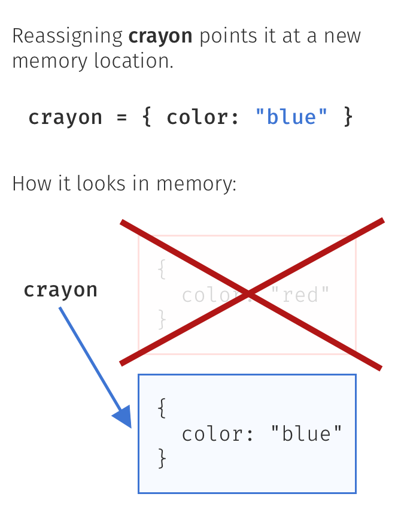

*"JavaScript is a synchronous (Moves to the next line only when the execution of the current line is completed) and single-threaded (Executes one command at a time in a specific order one after another serially)"*

# *"Everything in JavaScript happens inside an Execution Context"*

## Execution Context : 
- **Global Execution Context**: Created when the JavaScript file is first loaded. It's where the global code is executed (i.e., code not inside a function).
- Execution Context has two components and JavaScript code gets executed in two phases.
	1. **Memory Allocation Phase**
		- JavaScript **scans the entire code (compilation phase)** → Allocates memory for variables and functions.
		- **Before running the code, JavaScript scans the entire code** and sets up memory.
		- In the case of a function, **JavaScript copied the whole function into the memory block** but in the case of variables, it assigns _undefined_ as a placeholder.
		- This **context** consists of:
		    - **Global Object**: In the browser environment, this is the `window` object.
		    - **`this`** keyword: In the global context, `this` refers to the global object (i.e., `window` in the browser).
	2. **Code Execution Phase** : 
		- JavaScript code is executed one line by line code.

### E.g. Let’s see the whole process through an example.
#### 1. Example Code :
```
var number = 2; 
function Square (n) { 
	var res = n * n; 
	return res; 
} 
var newNumber = Square(3);
```

**Step 1: Global Execution Context (GEC)** - Creation Phase
  - When the JavaScript engine starts executing the script, the first step is creating the **Global Execution Context**. During the **Creation Phase**, memory is allocated for variables and functions, but no code is actually executed yet.
  - **Memory Allocation**:
	- `number`: Declared as `var`, initialized with `undefined` (at this stage).
	- `Square`: Declared as a function, and the entire function  is stored in memory.
	- `newNumber`: Declared as `var`, initialized with `undefined` (at this stage).
- At this point, **Global Memory** looks like this:
```
Global Memory:
number: undefined
Square: <function definition>  (){ .... }
newNumber: undefined
```

**Step 2: Global Execution Context (GEC)** - Code Execution Phase
- In the **Execution Phase**, the code is executed line by line, and the variables are updated with their actual values.
- `var number = 2;`:
    - The value `2` is assigned to the variable `number`.
    - Now, `number` is updated in the global memory.

- `function Square(n) { var res = n * n; return res; }`:
    - The function `Square` was already stored in the memory during the Creation Phase, so nothing changes here.
    
- `var newNumber = Square(3);`:
    - Now, the function `Square` is called with the argument `3`.
    - As soon as a function is invoked, a new **Function Execution Context (FEC)** is created for the `Square` function.
- At this point, **Global Memory** looks like this:
```
Global Memory:
number: 2
Square: <function definition>
newNumber: undefined (waiting for result from function)
```

 **Step 3: Function Execution Context (GEC)** - Memory Allocation Phase
 - When function invoked, new **Temporary execution context** will be created and it pushed to **Call Stack**.
 - **Memory Allocation** in the Function Execution Context:
    - `n`: Declared and initialized to `undefined`.
    - `res`: Declared and initialized to `undefined`.

At this point, the **Local Memory** of `Square` looks like this:
```
Local Memory (FEC for Square):
n: undefined
res: undefined
```

 **Step 4: Function Execution Context (GEC)** - Code Execution Phase
 - Now, the function body is executed line by line.
- `n = 3`:
    - The parameter `n` is assigned the value `3` (the argument passed during the function call).
    
- `var res = n * n;`:
    - The expression `n * n` is evaluated. Since `n = 3`, `3 * 3 = 9`.
    - The result `9` is stored in the local variable `res`.
    
- `return res;`:
    - The value `9` is returned from the function, and the **Function Execution Context** for `Square` is destroyed (popped off the stack) will back to Global Execution Context.
    
At this point, the **Local Memory** of `Square` looks like this:
```
Local Memory (FEC for Square):
n: 3
res: 9
```

 **5. Back to Global Execution Context (GEC)**
- The returned value `9` from the `Square` function is assigned to the variable `newNumber` in the **Global Execution Context**.

- `newNumber = 9`:
    - The value `9` is now assigned to `newNumber`.
    
- At this point, the **Global Memory** looks like this:
```
Global Memory:
number: 2
Square: <function definition>
newNumber: 9
```

- Now code completed everything will be clear from call stack .

## 1. Primitive Types (Stored Directly in Stack Memory)

Primitive values in JavaScript include:

- `Number` (e.g., `10`, `3.14`)
- `String` (e.g., `"hello"`)
- `Boolean` (`true`, `false`)
- `null`, `undefined`
- `Symbol`, `BigInt`
### **How They Are Stored?**

- Stored **directly** in **stack memory**.
-  When the value inside a box is a string/number/boolean/symbol/undefined/null, you can’t change the value. You can only create new boxes.
- **Same behavior as C/C++ and Java for primitive types (values are copied directly).**

```js
var a = 10;  
var b = a; // Copy of 'a' is assigned to 'b'

a = 20; // Changing 'a' does not affect 'b'
console.log(b); // 10
```
### What is a Reference in JavaScript?
- In JavaScript, variables don’t store actual values directly for non-primitive types. Instead, they **reference (point to)** the location in memory where the value is stored.
#### Example 1
- `word` points to a box containing the string `"hello"`
- A **new box** is created with `"world"` ,`word` now points to the new box.
- The old `"hello"` box is eventually **`cleaned up`** by `JavaScript's garbage collector`.

```js
let word = "hello";

word = "world";
```



## 2. Objects, Arrays, and Functions (Stored in Heap Memory)

Non-primitive types (objects, arrays, functions) are stored **by reference** in **heap memory**.
### **How They Are Stored?**

- The actual **object is stored in heap memory**.
- The **variable stores only a reference (memory address)** in stack memory.
- When assigned to another variable, only the **reference is copied, not the actual data**.

```js
var obj1 = { name: "Alice" };
var obj2 = obj1; // Reference to same object

obj1.name = "Bob"; 
console.log(obj2.name); // "Bob" (both point to same object)

```