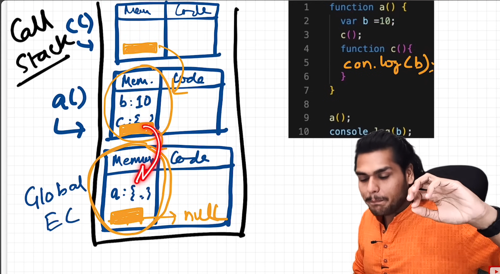
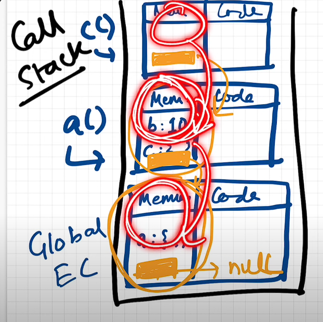
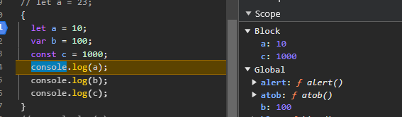
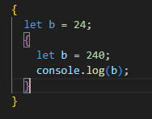
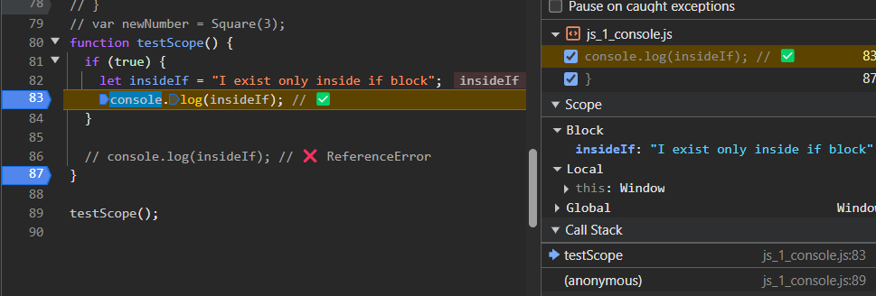

## _It is an area or ==region within that we can access specific var & fun==._

## Lexical Environment

- When ever JS code run, it create GRC in memory it create lexical scope
- lexical scope is local memory & parent's lexical memory.
- **Lexical Memory = Local memory + Lexical Env of parent's All memory**.
- Lexical means Hierarchy (one inside another).

### Example 1 :

- A function’s scope chain is determined at the time of `function definition`, not where it's called.
- `Lexical` meaning that one side another here, function `c` is inside function `a` lexically.
  - Here Function `c` get in FEC it get ref of their parent (lexical) memory means function `a`
    like wise function `a` get memory ref their parent current is GEC.

```js
function a() {
  var b = 10;
  c();

  function c() {
    console.log(b);
  }
}

a();
console.log(b);
```

#### BTS :

- Here, in function `c` when line `console.log(b)` first of it will look int their memory if found then access that variable else it goes to their parent memory if not their then here it will go to Global execution panel if not there then will throw error.
- Here, found inside function `b`.



### Example 2 : Function Calling

- A function’s scope chain is determined at the time of `function definition`, not where it's called.

```js
function foo() {
  var a = 2; // Local to foo()
  console.log(a); // OK
  foo1(); // Calls another function
}

function foo1() {
  console.log(a); // a is not in this scope
}
```

#### BTS :

- `foo1()` is declared in **global scope**, so its outer environment is the **global scope**, not `foo()`.
- It **does not have access** to variables declared in `foo()`.
- Since `a` is not declared in `foo1()`, JS engine **looks outward** to the global scope.
- `a` is not declared in global scope. It throws **ReferenceError: `a` is not defined**

### Scope chaining



## Temporal Dead Zone

- **Temporal Dead Zone (TDZ)** refers to the time between the hoisting of a variable (using `let` or `const`) and its initialization. During this time, the variable cannot be accessed.
- **let** & **const** also are **Hoisted but diff from 'var'.**
- These are in temporal dead zone for that time.
- ![[img3.png]]
- **`var`**: Hoisted and initialized with `undefined`.
- **`let` and `const`**: Hoisted but **not initialized**. They enter the TDZ until they are explicitly assigned a value.

```
console.log(a); // undefined (var is hoisted and initialized to undefined)
	var a = 10;

console.log(b); // ReferenceError: Cannot access 'b' before initialization
let b = 20;

console.log(c); // ReferenceError: Cannot access 'c' before initialization
const c = 30;

```

#### 1. Syntax Error

- **Definition**: A Syntax Error occurs when the code does not conform to the language's rules or syntax norms.
- **Characteristics**:
  - Indicates a problem with the structure of the code.
  - Prevents the code from being executed.

**Examples**:

1. **Declaring a `const` without an initializer**

```
const x; // SyntaxError: Missing initializer in const declaration
```

2. **Function declaration without braces**

```
function myFunction // SyntaxError: Function declarations require a function body
```

#### 2. Reference Error

- **Definition**: A Reference Error occurs when the code tries to access a variable or function that is not defined or accessible in the current scope.
- **Characteristics**:
  - Indicates a problem with the variable's or function's availability.

**Examples**:

1. **Accessing a variable before initialization**

```
console.log(a); // ReferenceError: Cannot access 'a' before initialization
let a = 10;
```

2. **Accessing a variable that is not defined**

```
console.log(bb); // ReferenceError: bb is not defined
```

## Block Scope

- Block Scope is defined this `{......}`.
- It basically **grp all statement into one block** E.g. if else . Loop. Fun. Class inside this all consider as block.
- ### **Let & const are in Block scope.**
- For `let` and `const` separate new memory block will be created.

**Examples**:

1. **Declare Variable & Access within Scope**

   - `let` & `const` are _BLOCK Scope_ so outside the block it won't be accessible.
   - `var` is function-scoped — it’s accessible throughout the function.
   - `let` and `const` are block-scoped — only accessible within `{}` where declared.

- E.g. Here, var `a & c` are only accessible within that block and `b` store store inside global scope.
  

2. **Nested Scope (Lexical Scope)**

   - Block Scope also Follow Lexical Scope like func.



3. **Declaring variables inside `try`, `if`, `for`**



4. **Function Declaration Inside Block**

- In modern JavaScript (ES6+), **functions declared inside blocks** are **block-scoped**, similar to `let` and `const`.
- The `sayHi` function is **only accessible inside that block**.

```JS
{
  function sayHi() { console.log("Hi!"); }
}

sayHi(); // ReferenceError: sayHi is not defined
```

5. **Block Scope Syntax Error**

- Here, `var d` is **hoisted to the top of the function or global scope** , the **same scope** where `let d` already exists.

```js
let d = 1;
{
  var d = 2;
}

//Output
SyntaxError: Identifier 'd' has already been declared
```

## Shadowing

- if a **local variable** has the same name as a **global variable**, the local one **overrides** (or shadows) the global one **inside that scope**.

### Example 1: Override the Value

- There are **two variables named `i`**, but the **local one (inside the function)** hides or "shadows" the **global one** while the function runs.
- The global `i` is still there — it’s just not visible _inside the function_ because the local `i` takes its place.

```js
var i = 100; // Global i

function test() {
  var i = 50; // Local i (shadows the global one)
  console.log("Inside function:", i);
}

test();
console.log("Outside function:", i);
```

```js
function testVarShadowing() {
  var value = "Outer scope";

  if (true) {
    var value = "Inner block scope";
    console.log("Inside block:", value); // Outputs: Inner block scope
  }

  console.log("Outside block:", value); // Also outputs: Inner block scope
}

testVarShadowing();
```

### Example 2. Diff Scope

- `var i` always **shadows** any outer variable named `i`, because `var` is **function-scoped**.

```js
function todo() {
  console.log(i);
  var i = 23; // Functional Scope i which Overrides
  i = 13; // Global Scope i
}
```
