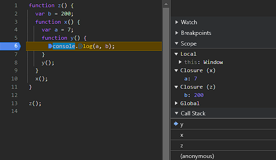

# Closures

- [Reference](https://medium.com/@rabailzaheer/understanding-javascript-closures-2caa2338a8f3)
- Function bundled with its lexical environment is known as a closure.
- Functions, that can **capture and remember their surrounding state**.
- A closure in JavaScript is a function that has access to the variables and parameters of its outer (enclosing) function, even after the outer function has finished executing.
- Closures typically occur when a function is defined inside another function.
- _Whenever function is returned, even if its vanished in execution context but still it remembers the reference it was pointing to. Its not just that function alone it returns but the entire closure_.

### Examples:

#### 1. Access Variable with help of Closure

##### How Closures Work:

- When a function is defined inside another function, the inner function has access to:
  - Its own variables.
  - The variables of the outer function.
  - The global variables.
- Even if the outer function finishes executing, the inner function retains access to the variables of the outer function because of the closure.
- Here, `func`. is executed in other scope rather `outerfunc`. scope still it access all ref of their out scope memory.

```
function outerFunction() {
  let outerVariable = "Hello";

  function innerFunction() {
    console.log(outerVariable); // innerFunction has access to outerVariable(lexical)
  }

  return innerFunction;
}

const closureExample = outerFunction();
closureExample(); // Outputs: "Hello"

```



#### 2. setTimeout with help of Closure

- The loop executes, and the all `setTimeout` callback is pushed to the event queue. By the time the `setTimeout` runs, the loop has already completed, so `i` is 3 (the final value after the loop).
- Here expected output it `1,2,3` after interval but due `var` value gets updated after loop ends will get latest value `setTimeout` is referring that.
- **Solution** : Using `let` instead of `var` ensures that each iteration of the loop gets its own ==separate copy of the variable==. This block-scoping property of `let` means that when the asynchronous function (e.g., `setTimeout`) executes, it captures the value of `i` as it was at the time of that iteration.
- `let` inside a `for` loop **creates a new `i` for every iteration** — it's **not just reassigned**, it's **re-declared per iteration block**

```
for (var i = 0; i < 3; i++) {
  setTimeout(function() {
    console.log(i);
  }, i*1000);
}

// Output : 3, 3, 3

------------------------------------------

for (let i = 0; i < 3; i++) {
  setTimeout(function() {
    console.log(i);
  }, i*1000);
}
// Outputs: 0, 1, 2

// BTS
{
  let i = 0;
  setTimeout(() => console.log(i), i * 1000);
}
{
  let i = 1;
  setTimeout(() => console.log(i), i * 1000);
}
{
  let i = 2;
  setTimeout(() => console.log(i), i * 1000);
}


```

### Advantages:

#### 1. Data Encapsulation and Private Variables

- Closures enable you to create private variables that can't be accessed or modified from outside the function. This helps in protecting the data from unintended changes.
- Closures help retain **state** between function calls without using global variables.

```
function createCounter() {
    let count = 0; // This variable is enclosed within the function

    return function() {
        count++;
        return count; // The inner function has access to the outer function's scope
    };
}

const counter1 = createCounter();
console.log(counter1()); // Output: 1
console.log(counter1()); // Output: 2
console.log(counter1()); // Output: 3

const counter2 = createCounter();
console.log(counter2()); // Output: 1 (new independent closure)
console.log(counter2()); // Output: 2

```

- Closures let you **hide variables** from the outside world — just like private variables in OOP.

```
function createUser() {
  let password = "secret123"; // private variable

  return {
    checkPassword: function (guess) {
      return guess === password;
    }
  };
}

const user = createUser();
console.log(user.checkPassword("secret123")); // ✅ true
console.log(user.password); // ❌ undefined (not accessible directly)
```

#### 2. Callback Functions:

- Closures are often used in asynchronous programming where a function needs to remember variables from its context.

#### 3. Event Handlers

- When writing event listeners, closures help ensure that handlers can access variables that were in scope when the handler was created.

#### 4. Memorization and Function Currying

### Disadvantages

- The variables declared inside a closure are not garbage collected.
- Too many closures can slow down your application. This is actually caused by duplication of code in the memory.
