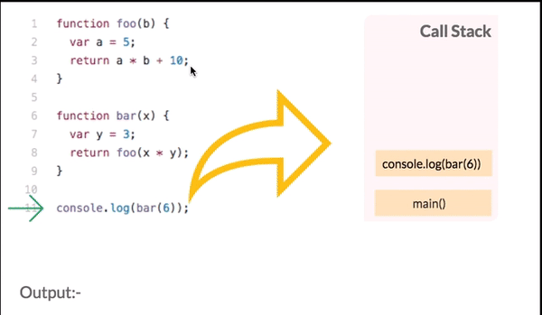
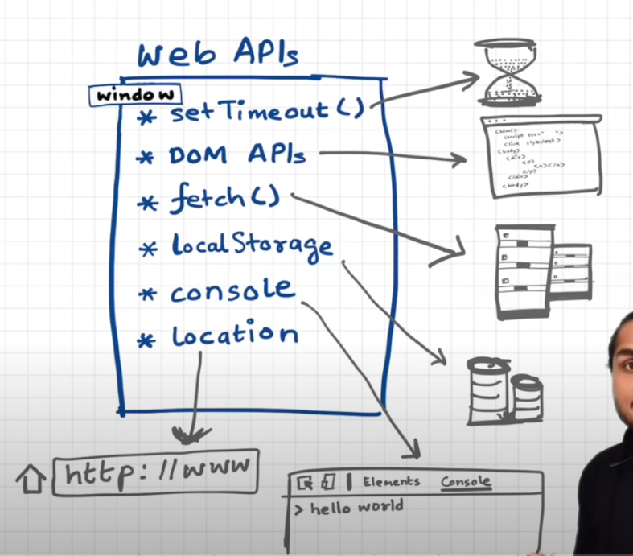

# JavaScript is Single Threaded

- **JavaScript is a single-threaded** language at runtime which means only one thing can happen at a time.
- JavaScript engine can **only process one statement at a time in a single thread**.
-  It also means you can’t perform long operations such as network calls without blocking the main thread. That’s **where asynchronous JavaScript comes into play**.
### What about asynchronous JavaScript

- In ASYNC operations such as `setTimout` , `Network Calls`  move on to the next line of code without running the function body and they **don’t create new threads**.
- So... who decides **when** these things actually run? 
### *How can JavaScript be single-threaded and non-blocking at the same time? How about when we run timers? Loops?*

# Event Loop
- https://medium.com/gradeup/asynchronous-javascript-event-loop-1c8de41298dd
- The **Event Loop** enables JavaScript to perform non-blocking operations by managing asynchronous tasks.
- It helps to JS handle ASYNC operation without blocking the main thread.
- Continuously checks if the call stack is empty and pushes tasks from the microtask queue or callback queue to the call stack for execution.

## How the Event Loop Works

## *> sync tasks → micro tasks → macro tasks*

To understand the Event Loop, we need to explore three primary components:
1. **Call Stack**
2. **Task Queue**
3. **Web APIs**
### **Call Stack:** 

- It stores function calls in the order they are invoked. When a function is called, it is added to the top of the stack, and when the function completes, it is removed from the stack.
- This allows JavaScript to keep track of function execution and manage the flow of code execution.

### **Web APIs**

-  Web APIs refer to sets of functionalities provided by the browser environment to interact with web-related features and resources.
- These APIs include the DOM API for manipulating HTML and CSS, the XMLHttpRequest (XHR) or Fetch API for making HTTP requests, the Geolocation API for accessing user location information, the local Storage ,cookies and session Storage etc.


### **Task Queues** 

- A **queue** is a data structure that follows the First-In-First-Out (FIFO) principle. This means that the first element added to the queue is the first one to be executed and removed. e.g. Ticket Queue

**Microtask Queue**:
- Examples of microtasks include: .then() of Promise, MutationObserver.
- The microtask queue has a higher priority than the **macrotask queue**. It is like VIP line and macro task is general line.
- After all task of micro queue is completed then callback queue task started.

*Note*
- Microtask are kind of **blocking in nature**.
- if you keep queuing tasks in the microtask queue forever, your browser will become unresponsive. You can’t click a button, can’t scroll, nothing…, GIFs stop, animations stop etc.

 **Callback Queue (Macro Task)**
 - Examples of macrotasks include: setTimeout, setInterval, I/O events, and DOM events (like click and load).
 - The event loop takes each macrotask from this queue to execute, but **only after all microtasks in the microtask queue** have been processed.
 - It is like general line and Micro task line is VIP line.
#### **Order of Execution**

1. Execute all **synchronous tasks** on the call stack.
2. Process all microtasks in the **microtask** queue.
3. Process the first task in the **macrotask** (callback) queue.
4. Repeat.
## Example
- https://medium.com/@ignatovich.dm/the-javascript-event-loop-explained-with-examples-d8f7ddf0861d
### Example 1 :  Callback Function with setTimeout Delay

```
console.log("1");

setTimeout(function () {
  console.log("2");
}, 1000);

console.log("3");
```
#### **Execution Flow**:

**Step 1:** JavaScript starts executing top to bottom (Call Stack begins)
**Step 2:** `console.log("1")` is executed  
	Output: `1`
**Step 3:** `setTimeout()` is encountered
	- Timer callback register in WEB API with attached timer
	- Callback function wait till the timer get expired.
**Step 4:** `console.log("3")` is executed  
	Output: `3`
**Step 5:** After ~1000ms, the `setTimeout` callback is ready added to the macrotask (callback) queue
**Step 6:** Event Loop checks if Call Stack is empty → Yes
**Step 7:** Moves callback to Call Stack and runs it → `console.log("2")`  
	Output: `2`

*Note  :* 
1.  Can we trust that `setTimeout(..., 0)` will run exactly after 0ms?
	**Answer:** No. The delay is _minimum_, not exact. The function is placed in the task queue and runs only after the call stack is clear and all microtasks have finished. If delay 5 sec and main thread is block till 10 then after main thread clear it will push to call stack.
### Example 2 :  Callback Function with DOM Event Handler

```
<button id="myBtn">Click Me</button>

<script>
  console.log("Script start");

  document.getElementById("myBtn").addEventListener("click", function () {
    console.log("Button clicked");
  });

  console.log("Script end");
</script>

``` 
#### **Execution Flow**:

**Step 1**: JavaScript starts executing (Global Execution Context)
 **Step 2**: `console.log("Script start")` is executed
	Output: `Script start`
**Step 3:** `addEventListener("click", ...)` is registered
- Browser sets up the listener for the `"click"` event
- The callback is registered inside Web API, but **not executed yet**
**Step 4:** `console.log("Script end")` is executed
	Output: `Script end`
###### After User Clicks the Button

**Step 5:** Browser detects a click event
- The registered callback is sent to the **macrotask queue**
**Step 6:** Event Loop checks if Call Stack is empty → Yes
- Callback is pushed onto the Call Stack
 **Step 7:** `console.log("Button clicked")` is executed
	Output: `Button clicked`

### Example 3 :  Callback Function with Zero Delay Timeout

```
<script>
  console.log("Script start");

  setTimeout(() => {
    console.log("Inside setTimeout");
  }, 0);

  console.log("Script end");
</script>
```

- **Step 1:** JavaScript starts executing from top to bottom (Global Execution Context is created)
- **Step 2:** `console.log("Script start")` is executed  
    Output: `Script start`
- **Step 3:** `setTimeout(..., 0)` is encountered
    - Timer is passed to Web API
    - Callback is scheduled and sent to the **macrotask queue** after 0ms
    - It does **not execute immediately**
- **Step 4:** `console.log("Script end")` is executed  
    Output: `Script end`
- **Step 5:** After the current call stack is empty and 0ms is done, the callback from `setTimeout` enters the call stack
- **Step 6:** Callback runs → `console.log("Inside setTimeout")`  
    Output: `Inside setTimeout`
### Example 4 :  Nested Promises with setTimeout
- Nesting Promises creates a queue of microtasks that execute in the same cycle.

```
console.log('A');  
  
setTimeout(() => {  
	console.log('B');  
	Promise.resolve().then(() => {  
		console.log('C');  
	});  
}, 0);  
  
Promise.resolve().then(() => {  
	console.log('D');  
	setTimeout(() => {  
		console.log('E');  
	}, 0);  
});  
  
console.log('F');
```

**Output**:
1. `A` (Synchronous)
2. `F` (Synchronous)
3. `D` (Microtask from `Promise`)
4. `B` (Macrotask from `setTimeout`)
5. `C` (Microtask created within the `setTimeout`)
6. `E` (Macrotask from the inner `setTimeout`)